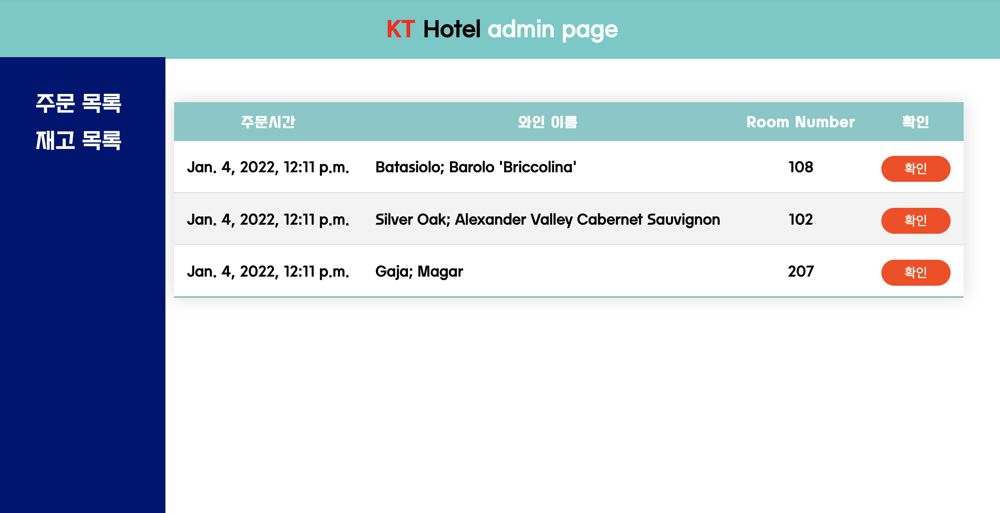
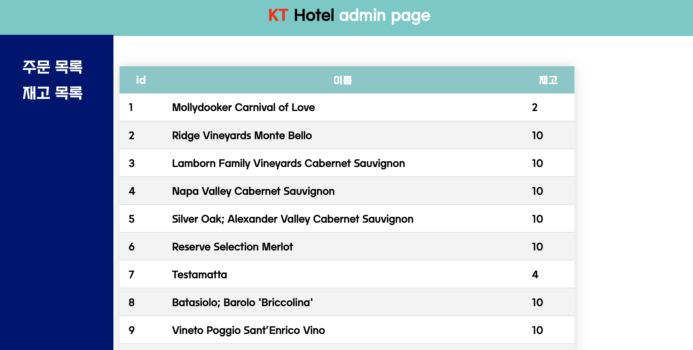

# TM-wine admin page info

### 현재 구현된 기능
  - POST로 와인 이름, 방 정보 날리면 관리자 페이지에서 확인 가능 (Postman으로 테스트)
    - 단, 수동으로 확인해야함 (자동으로 주문 목록이 update되지 않음)
    - wineData.csv 에 있는 이름 그대로 POST 요청해야함. (목록 외 요청에 대해 예외처리 X)
  - 확인한 주문건에 대하여 삭제 가능
  - 실시간으로 재고 현황 변경 가능 (확인한 주문건에 대한 와인 재고 1만큼 감소)
    - 단, 음의 값이 되었을때 예외처리 하지 않았습니다

### 참고사항
- views.py 의 pymysql.connect 부분 수동으로 수정 부탁드립니다 . ㅠㅠ
- example data로 기존에 사용했던 wineData.csv를 수정하여 추가하였습니다. 재고현황에 관한 데이터로 orderlist에 올려 사용하시면 됩니다.

### Pre-view

- 주문 목록 : http://127.0.0.1:8000/order

- 재고 목록 : http://127.0.0.1:8000/storage

